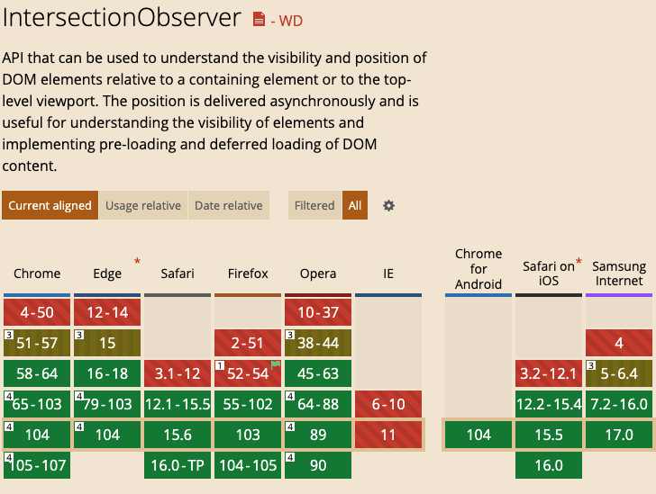

# 프론트엔드 웹기술에 대한 지원 브라우저 목록 확인

## caniuse.com

A개발자에게 
페이지 스크롤 중 특정영역이 보여질 때
태그수집을 위해 태그API를 호출하는 구현을 한다고 가정합시다.

단순히 생각하면
스크롤이 움직일 때 이벤트를 받아서 
특정영역의 전체가 다 보이는 지를 계산하는 JS스크립트를 작성할 수 있습니다.

이 때 특정영역의 갯수가 많고
높이도 각각 다르다면
이 것을 계산하기 위해 많은 준비과정이 필요할 수도 있습니다.

운이 좋게도 이런 기능을 쉽게 처리할 수 있는 웹기술이 2016년에 발표되었습니다.
IntersectionObserver라는 이름으로 W3C Working Draft에 추가된 것입니다.
스크롤이 기준이 아닌 특정영역을 기준으로
전체가 다 보여 졌을 때를 알 수 있는 기능을 가진 API 이기 때문에 쉽게 개발이 가능 해졌습니다.

A개발자는 IntersectionObserver를 사용해 개발을 완료하고
배포를 해서 동작이 잘된다고 좋아하고 있었는데
iOS 11 에서 동작이 안된다는 민원을 받게 됩니다.

A개발자는 2016년에 추가된 규격이라 당연히 모든 브라우저가 이 기능을 다 지원할 거라고 생각을 했을 겁니다.
그러나 이런 기능들을 사용할 때는 반드시  caniuse.com에 검색해서 타켓 브라우저를 확인해야 합니다.

caniuse.com은 프론트엔드 웹 기술을 지원하기 위한 최신 브라우저 지원 테이블을 제공합니다.
브라우저 지원 테이블은 https://github.com/Fyrd/caniuse 에 raw data 가 json 형태로 매주 갱신되고 있습니다.

caniuse.com의 웹 기술에 대한 카테고리 분류는 아래와 같습니다.

	⁃	CSS : CSS 관련 규격
	⁃	HTML5 : HTML 관련 규격
	⁃	SVG : SVG 관련 규격
	⁃	JS : JavaScript 관련 규격
	⁃	JS API : Browser내에서 구현하여 제공하는 API
	⁃	Other : Audio, Video, Image 포멧 등 기타 규격
	⁃	Security : Browser내에서 구현된 보안관련 규격

프론트엔드 개발자는 개발하고 있는 웹/앱의 타켓 브라우저를 반드시 먼저 정의해야 하고
웹 기술을 적용하기 전에 caniuse.com으로 검색하는 습관을 가져야 합니다.

프론트엔드 웹기술은 브라우저 내에 Native 언어(C/C++)로 구현되어 있지만
JavaScript로도 기능을 구현할 수  있습니다.
이런 코드를 polyfill이라고 부릅니다.
사용하려고 하는 웹기술을 Google에서 polyfill을 뒤에 붙여 검색하면 관련 코드를 찾을 수 있습니다.
polyfill 코드는 JavaScript뿐만 아니라 CSS나 JS API 관련된 것도 있습니다.

위의 intersectionObserver에 대해서도 polyfill이 존재하고 관련 js파일을 찾아서 추가하면 iOS11에서도 오류없이 동작이 가능합니다.

## caniuse-lite

2015 이후 JavaScript(공식명 ECMAScript)는 매년 6월 새로운 버전을 발표하고 있습니다.
브라우저와 Node.js 등 에서 동일하게 사용되는 표준 언어이고, caniuse.com 카테고리 중 JS에 해당하는 부분입니다.

매년 추가되는 JavaScript의 새로운 기능을 타켓 브라우저에 관계없이 사용할 수 있을까요?

모든 JS 규격에 해당하는 polyfill이 있다면 가능하겠죠?

Node.js가 탄생한 이후 프론트엔드 개발 방법은 획기적으로 변했다고 할 수 있는데,
2014년부터 Node.js를 빌드시스템으로 사용하면서
여러가지 빌드도구들(grunt, gulp, webpack, babel 등)이 생겨나고 대중화되었습니다.

이 중에 트랜스파일러라고 불리는 Babel은 최신JS규격 소스를 타켓JS 소스로 변환해주는 빌드도구입니다.

이 빌드도구를 이용하면,
개발은 최신 JS소스로 개발하고
배포는 빌드를 해서 타켓 브라우저에서 돌아가는 JS를 생성하게 됩니다.

이런 환경 탓에 프론트엔드 개발자들은 매년 최신 JS를 공부해야겠죠.

Babel은 
.browserslist 파일이나 package.json에 “browserslist”에 기입된 타켓 브라우저 목록에 맞게
caniuse-lite(caniuse.com의 raw data를 빠르게 비교 되도록 가볍게 만들어 놓은 라이브러리) 를  기준으로 polyfill을 자동으로 채워주게 됩니다.
